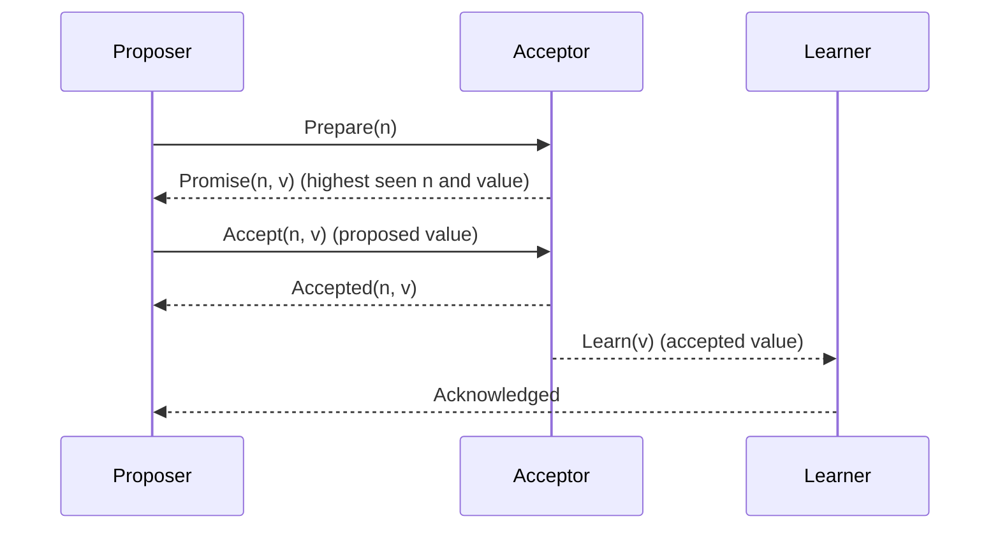

### [Paxos made simple](https://lamport.azurewebsites.net/pubs/paxos-simple.pdf)

To run, first setup the environment by running `nix develop` in the root of the repository, or allow `direnv` to do it automatically if you have it installed in your machine.

### Architecture
In this implementation, we simulate a varying number of nodes that communicate with each other. The goal is to simulate a "distributed" fibonacci sequence.
In each round, proposers are going to send a value `n` that must be added to the current value `n` of the nodes. 
After the protocol phases are completed, we expect that all nodes will have the same value. This is tested by running the algorithm a few times and checking the value for each node.

For the sake of simplicity, we'll have three learners, separated from other nodes. These learners will be responsible for actually writing the data in the storage.

The algorithm halts in a few scenarios:
- if there's no proposer, or if there's more than one proposer
- if there's no learners

TODO

- [ ] auto format on pre-commit
- [ ] pass parameters using CLI
- [ ] set up sqlite database
- [ ] store node ids (in case some node dies, etc)
- [ ] use a generic interface to allow nodes to rotate positions, so that for each "round" nodes can be assigned different roles instead of fixed acceptors and proposers. Idk about learners
