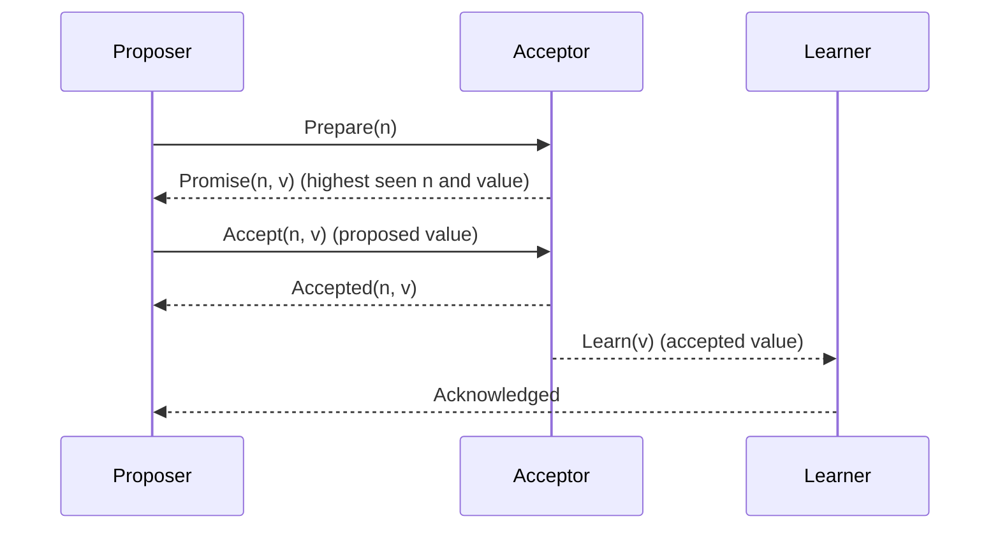

### [Paxos made simple](https://lamport.azurewebsites.net/pubs/paxos-simple.pdf)

To run, first setup the environment by running `nix develop` in the root of the repository, or allow `direnv` to do it automatically if you have it installed in your machine.

### Architecture
In this implementation, we simulate a varying number of nodes that communicate with each other. The goal is to simulate a "distributed" fibonacci sequence.
In each round, proposers are going to send a value `n` that must be added to the current value `n` of the nodes. 
After the protocol phases are completed, we expect that all nodes will have the same value. This is tested by running the algorithm a few times and checking the value for each node.

This is a kind of simplified version of Paxos, so for now it does not support multiple proposers and learners. It also implies that the algorithm will halt if there's no proposer os learner (which is, if their nodes die in the process).

In this implementation, the proposer performs the roles of both the proposer and learner, being the "leader" of the round, as stated in the "Paxos made simple" paper:

> The algorithm chooses a leader, which plays the roles of the distinguished proposer and the distinguished learner. 

TODO

- [ ] auto format on pre-commit
- [ ] pass parameters using CLI
- [ ] set up sqlite database
- [ ] handle `Lagged` error in broadcast. Congestion window?
- [ ] store node ids (in case some node dies, etc)
- [ ] allow more learners
- [ ] allow more proposers
- [ ] remove `expect`s and `unwrap`s and improve code in general
- [ ] use a generic interface to allow nodes to rotate positions, so that for each "round" nodes can be assigned different roles instead of fixed acceptors and proposers. Idk about learners
